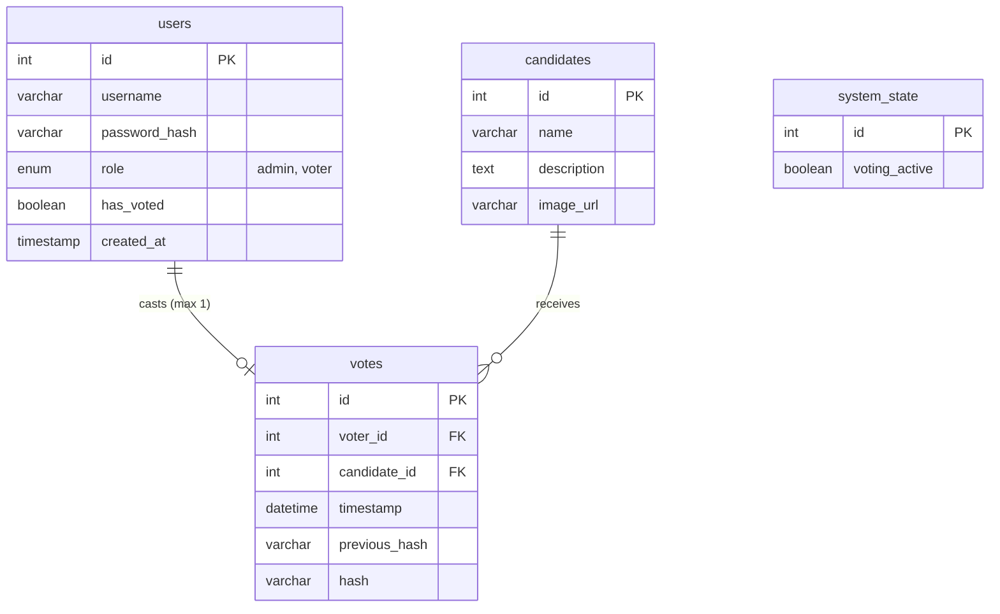

# Database ER Diagram

This document illustrates the Entity-Relationship structure for the Blockchain Voting System.

```mermaid
erDiagram
    users {
        int id PK
        varchar username
        varchar password_hash
        enum role "admin, voter"
        boolean has_voted
        timestamp created_at
    }
    
    candidates {
        int id PK
        varchar name
        text description
        varchar image_url
    }
    
    votes {
        int id PK
        int voter_id FK
        int candidate_id FK
        datetime timestamp
        varchar previous_hash
        varchar hash
    }
    
    system_state {
        int id PK
        boolean voting_active
    }

    users ||--o| votes : "casts (max 1)"
    candidates ||--o{ votes : "receives"
```
