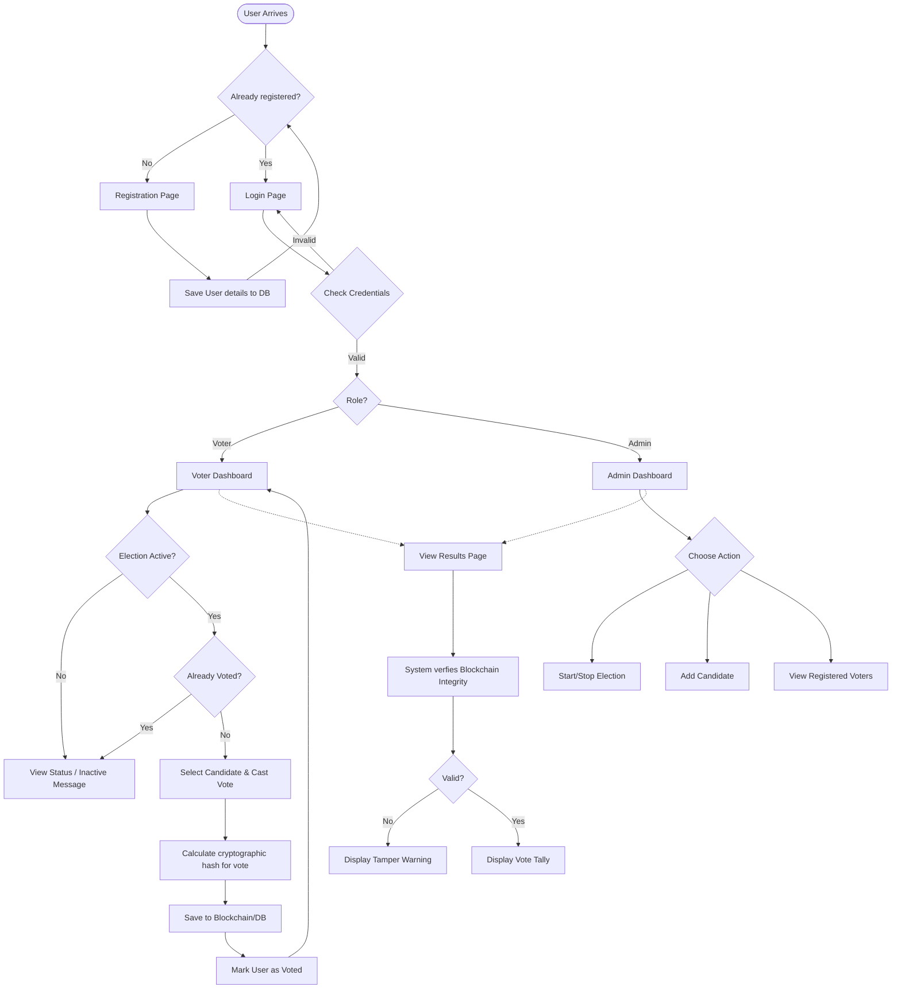

# System Flowchart

This document illustrates the core flows of the Blockchain Voting System.

```mermaid
graph TD
    Start([User Arrives]) --> Login{Already registered?}
    
    Login -- No --> Register[Registration Page]
    Register --> ProcessReg[Save User details to DB]
    ProcessReg --> Login
    
    Login -- Yes --> Auth[Login Page]
    Auth --> VerifyDB{Check Credentials}
    VerifyDB -- Invalid --> Auth
    
    VerifyDB -- Valid --> RoleCheck{Role?}
    
    %% Voter Flow
    RoleCheck -- Voter --> VoterDashboard[Voter Dashboard]
    VoterDashboard --> CheckStatus{Election Active?}
    CheckStatus -- No --> Wait[View Status / Inactive Message]
    CheckStatus -- Yes --> CheckVoted{Already Voted?}
    CheckVoted -- Yes --> Wait
    CheckVoted -- No --> Vote[Select Candidate & Cast Vote]
    Vote --> GenerateHash[Calculate cryptographic hash for vote]
    GenerateHash --> SaveVote[Save to Blockchain/DB]
    SaveVote --> MarkVoted[Mark User as Voted]
    MarkVoted --> VoterDashboard
    
    %% Admin Flow
    RoleCheck -- Admin --> AdminDashboard[Admin Dashboard]
    AdminDashboard --> AdminActions{Choose Action}
    AdminActions --> ManageElection[Start/Stop Election]
    AdminActions --> ManageCandidates[Add Candidate]
    AdminActions --> ViewVoters[View Registered Voters]
    
    %% Results
    VoterDashboard -.-> ViewResults[View Results Page]
    AdminDashboard -.-> ViewResults
    ViewResults --> VerifyChain[System verfies Blockchain Integrity]
    VerifyChain --> IntegrityCheck{Valid?}
    IntegrityCheck -- No --> ShowTampered[Display Tamper Warning]
    IntegrityCheck -- Yes --> ShowTally[Display Vote Tally]
```
